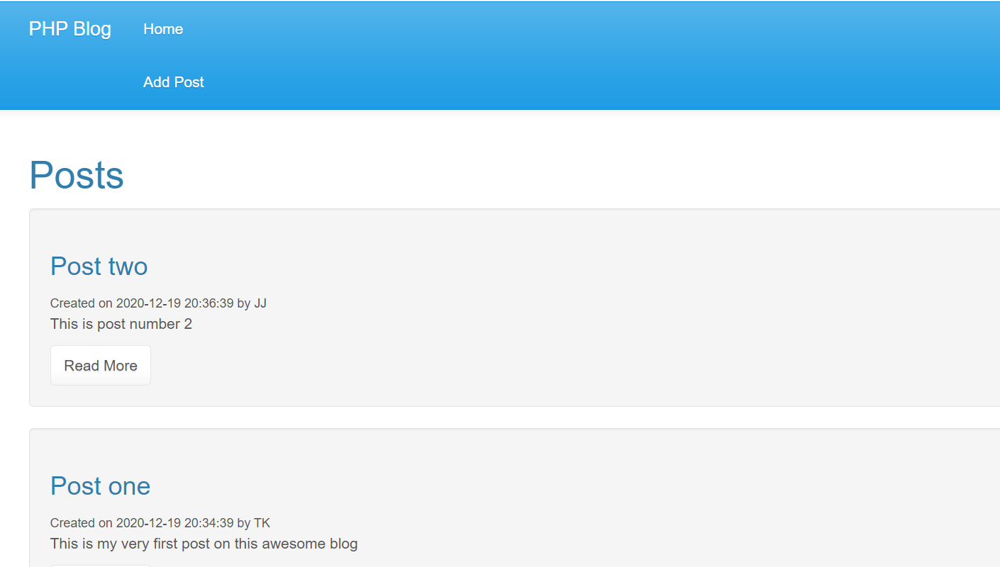
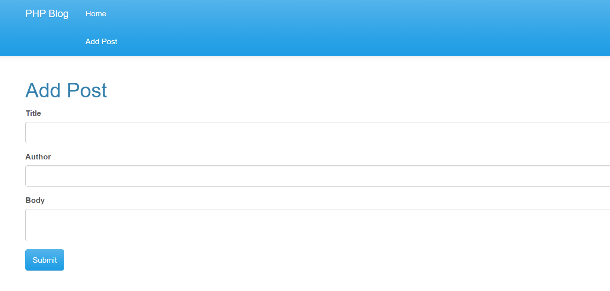
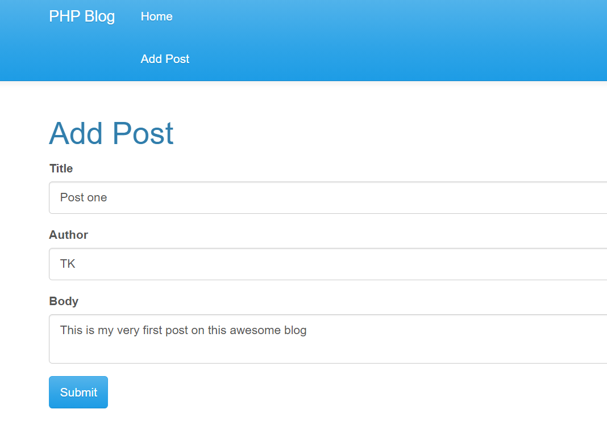

# BLOGPOST PHP

This is a **simple PHP Blogpost app**.
___

## Features

- Delete Post
- Update Post
- View Post
- Database
___ 

## Installation

- In order to run the project you need to have AMPPS and database managing application installed (MySQL Workbench preferred)
- Navigate to the main page of the repository and download (.zip file) or clone the project.
- Add the project folder to your AMPPS projects directory ("../Ampps/www/").
- Open the directory via localhost.
___

## Screenshots

___